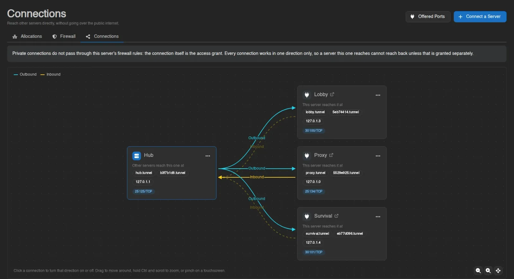
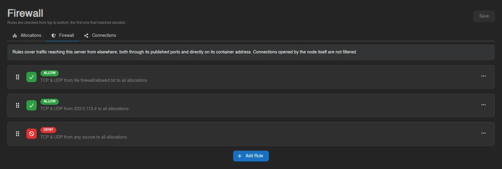
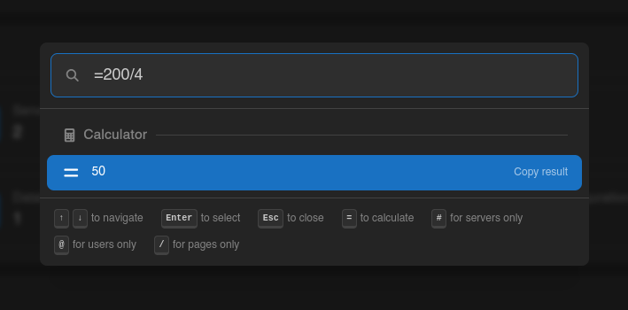
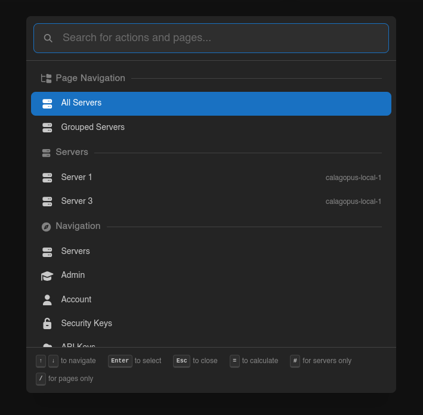
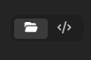
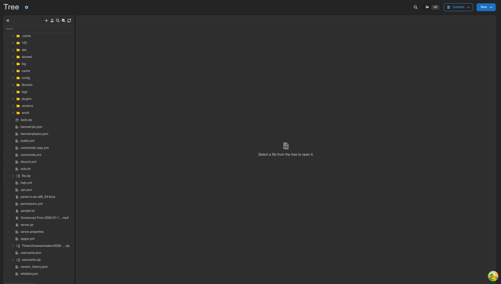
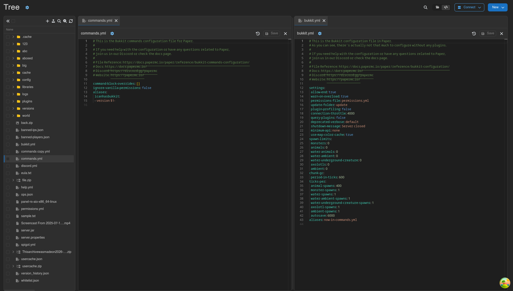
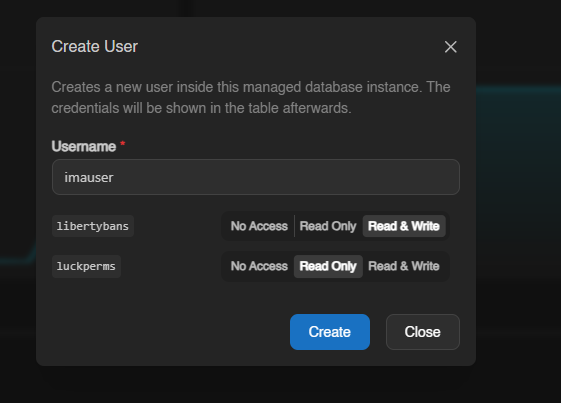

# Release 1.2.0

## Private Networking

Traditionally, servers on different nodes can only reach eachother via the public internet through public ports. Using
the new private networking feature, you can deviate from this behaviour by sending node-to-node traffic through an
encrypted tunnel, without touching the public internet.

It achieves this by establishing a mTLS QUIC tunnel between node pairs. We have developed our own application, called
[Tundra](https://github.com/calagopus/tundra), to support this.

This is what a simple game network may look like:

A full guide can be found in our documentation for Calagopus [panel](https://calagopus.com/docs/panel/features/server/network/connections)
and [wings](https://calagopus.com/docs/wings/advanced/private-network).

## Firewalls

To stay on the topic of networking, a big improvement to security has been made with the implementation of firewall
capabilities. Allow or deny traffic based on protocol, IP address, entire subnets, or even an entire list from file
content. Rules are evaluated top to bottom, and apply immediatly when saved.

This granular control gives server administrators the power to block bad actors and spammers, or allow specific people
onto your server.

## Quick Actions

Also introduced in this update are Quick Actions. One simple keybind (`Ctrl + Space` by default) gives you the power to
navigate the panel using just your keyboard. Search for servers, pages, actions, or users from a simple menu.

Using search prefixes, the results can be filtered by type.
- `=` serves as a calculator 
- `#` serves as a server-only filter
- `/` serves as a page-only filter
- `@` serves as a user-only filter (available on `/admin`)

The best part? This can be extended! Read more about [extending Quick Actions](https://calagopus.com/docs/panel/extensions/concepts/quick-actions).

## File Tree Editor

The File Manager has gained a twin this update. Using the selector at the top right corner, the new tree editor can be
opened.

This tree editor has a look and feel more similar to a traditional code editor. Multiple files can stay open at once,
and even viewed in split view.

## DB Agent ACL Support

For databases provisioned using the [DB Agent](https://calagopus.com/docs/db-agent/overview), there is now support for
ACL based access. Specify which user is allowed to access which database, and with which permission set (none, read only, read & write).

## DB Agent Backups

More news for the [DB Agent](https://calagopus.com/docs/db-agent/overview), native backups can now be made of provisioned
databases. It uses the same backup configuration as the server, and can be easily downloaded or restored as well.

Read more about [Database Backups](https://calagopus.com/docs/panel/features/server/backups#database-backups).
